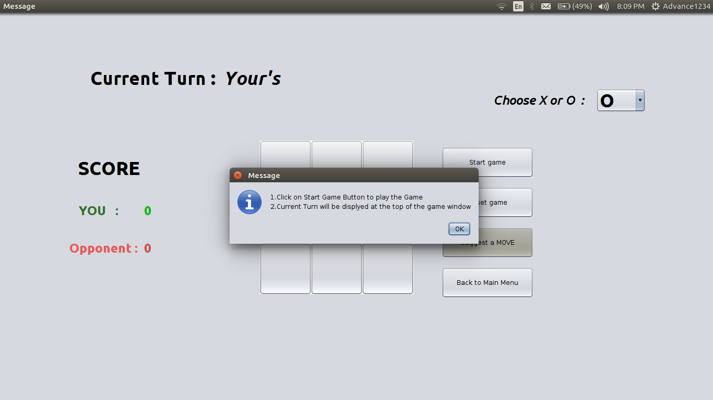
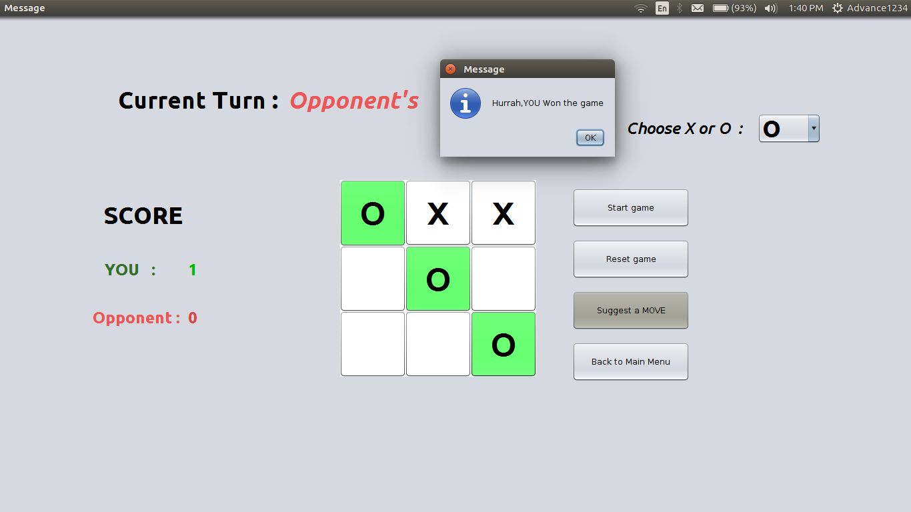

# Tic-Tac-Toe Game
This is a simple implementation of the Tic-Tac-Toe game in Java, using a graphical user interface (GUI) built with the Swing library. The game allows two players to play against each other, or or play against the machine, taking turns to place their marks on the board until one of the players wins or the game ends in a tie.

## Installation
To run this game, you will need to have Java installed on your computer. You can download the latest version of Java from the official website.

After installing Java, you can download or clone this repository to your computer. Navigate to the project folder in the terminal/command prompt, and compile the Java files

### Running the project

Just Download the Jar file from [here](https://github.com/Saurabh1999/Tic-Tac-Toe/raw/master/executable%20jar/Tic_Tac_Toe.jar)
and run it by executing the follwing command
```
java -jar Tic_Tac_Toe.jar
```
 
|



## Contributing
If you find any bugs or issues with the game, please open an issue on the GitHub repository. Pull requests are also welcome if you want to contribute to the code.

## License
This project is licensed under the MIT License - see the LICENSE file for details.

## Credits
This game was developed by AtlaDev.